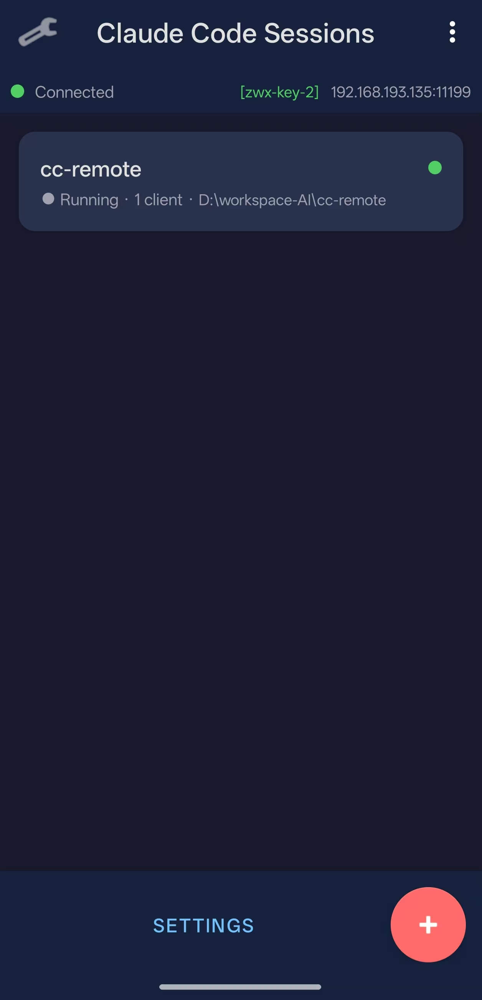
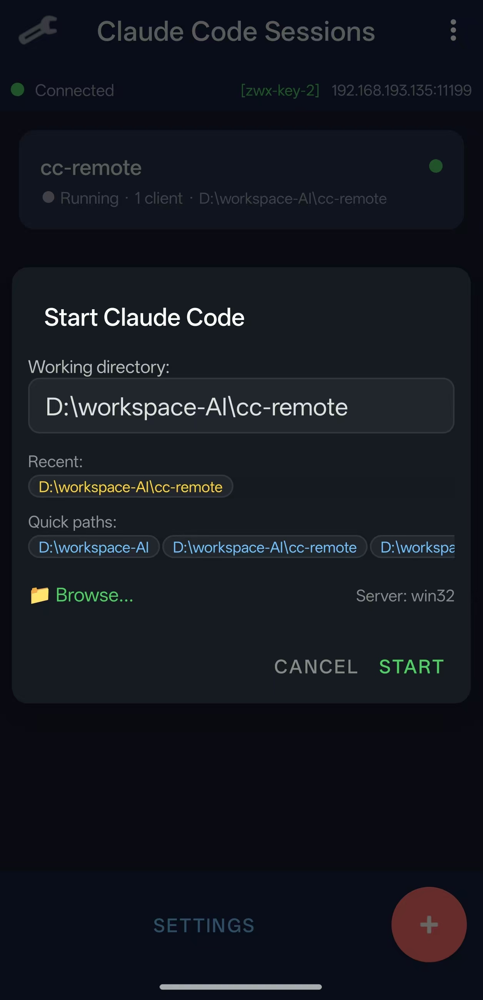
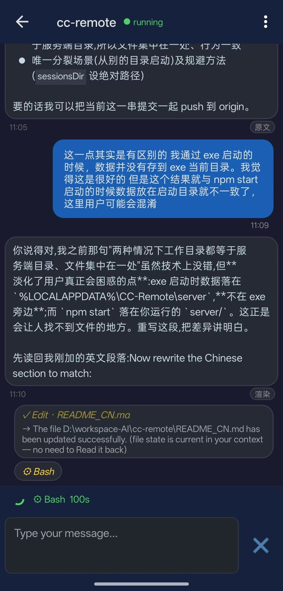
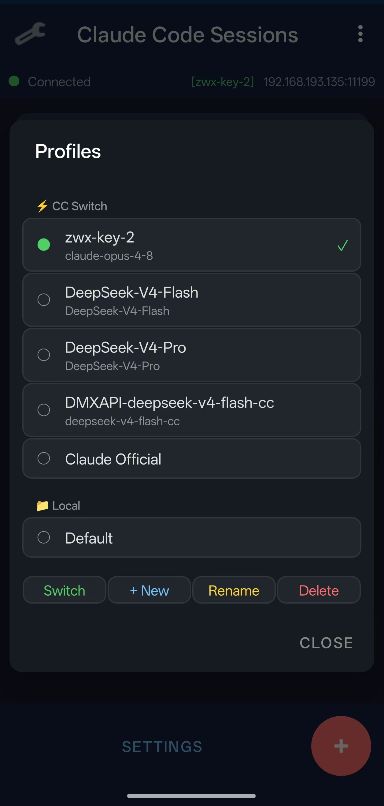
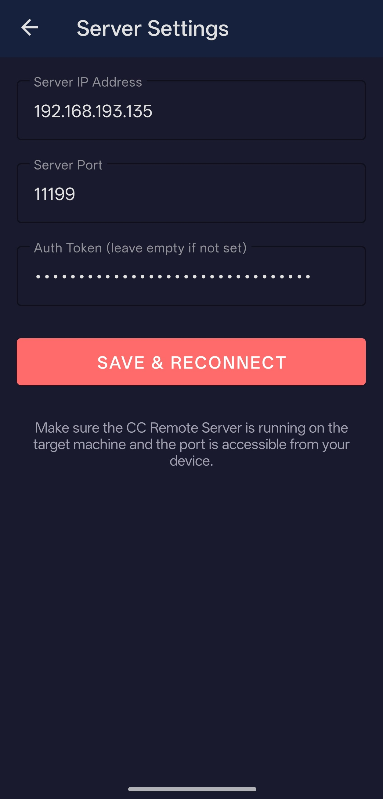
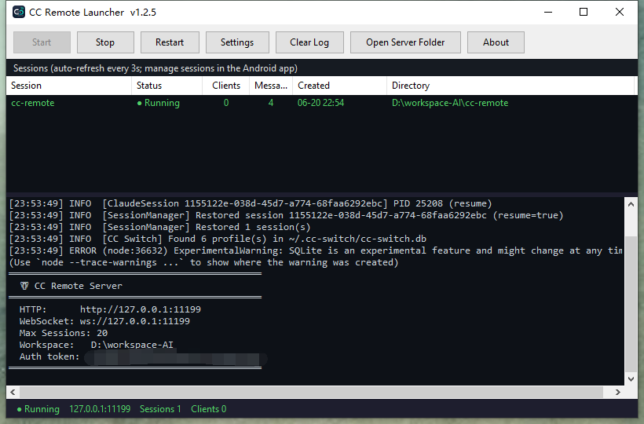

# CC Remote

**躺在沙发上写代码。** CC Remote 让你用 Android 手机远程操控工作站上的 Claude Code — 浏览项目目录、启动编程会话、切换 AI 供应商、用聊天的方式指挥 Claude 干活。专为 vibe coder 打造：灵感来了掏手机就能写，不用被绑在电脑前。

喝咖啡时突然有个想法？掏出手机，用自然语言描述需求，Claude Code 在你的真实开发机上帮你搞定。你只需要手机和电脑之间有个网络连接。

> [English](README.md) | 中文

## 截图

| 会话列表 | 启动会话 | 聊天 |
|:---:|:---:|:---:|
|  |  |  |
| **供应商 / 模型选择** | **服务器设置** | |
|  |  | |

**Windows 启动器** —— 一键控制服务端，带实时日志和只读会话列表：



## 工作原理

```
┌──────────────┐   WebSocket (JSON)   ┌────────────────┐  stream-json  ┌──────────┐
│  Android App │ ◄──────────────────► │ Node.js Server │ ◄───(stdio)──► │  claude  │
│   (随时随地)  │   局域网 / VPN 连接   │   (你的电脑)    │               │   CLI    │
└──────────────┘                     └────────────────┘               └──────────┘
```

1. **Node.js 服务端**运行在你的工作机上。每个会话是一个常驻的 `claude -p` 进程，跑在 stream-json 模式下（headless，无 PTY）—— 用户的每一轮输入以 NDJSON 写入 stdin，Claude 的流式事件从 stdout 返回。
2. **Android 应用**通过 WebSocket 连接，列出会话、浏览目录、切换供应商、与 Claude 对话。
3. Claude Code 在你的工作机上读写文件，就像你正坐在键盘前一样。

聊天界面实时渲染 Claude 的 Markdown 回复 —— 包括表格、代码块、链接。你用自然语言描述需求，Claude 执行，你在手机上看到流式的实时结果。会话是持久化的：服务端重启后依然存在，并通过 `--resume` 带着完整上下文恢复。

## 通过 ZeroTier 远程访问

服务端默认监听局域网地址。想在咖啡馆、办公室或沙发上随时连接？用 [ZeroTier](https://www.zerotier.com/) 创建虚拟局域网：

1. **在 [my.zerotier.com](https://my.zerotier.com) 创建一个 ZeroTier 网络**
2. **在你的工作机和 Android 手机上安装 ZeroTier**，把两台设备都加入你的网络
3. **启动 CC Remote 服务端** —— 默认绑定 `0.0.0.0`，ZeroTier 虚拟网卡也能访问
4. **在 Android 应用中配置**你工作机的 ZeroTier IP（如 `10.147.17.x:11199`）

搞定。无论你用的是移动数据还是 Wi-Fi，手机和电脑都在同一个虚拟局域网里，就像在同一间屋子里。无需端口转发、无需动态 DNS、无需把服务暴露到公网。

> **提示：** ZeroTier 免费支持最多 25 台设备。如果遇到严格的防火墙限制，可以试试 [Tailscale](https://tailscale.com/) —— 底层基于 WireGuard，与 CC Remote 配合同样完美。

## 功能

- **会话管理** —— 创建、列出、连接、停止/恢复、删除 Claude Code 会话；多个会话可同时运行
- **持久化会话** —— 服务端重启后会话依然存在，并带着完整上下文恢复（`--resume`）；已暂停的会话重启后仍保持暂停
- **供应商与模型切换** —— 在应用里随时切换会话使用的 AI 供应商/模型，并自动发现 [CC Switch](https://github.com/farion1231/cc-switch) 配置
- **Markdown 渲染** —— 完整支持 Markdown，包括表格、代码块、链接
- **实时活动视图** —— 状态条实时显示 Claude 当前在干什么（思考 / 运行工具及其参数 / 输出回复）并带计时；某轮长时间无响应时变为琥珀色，方便区分「卡住」和「只是慢」，且整轮过程中随时可中断；工具调用会在聊天里留下可滚动的 `⚙ 名称 · 详情` 轨迹
- **工作区限制** —— 可配置服务端锁定到指定目录，禁止访问外部路径
- **目录浏览** —— 从 Android 端浏览服务端文件系统选择工作目录，带最近路径和快捷路径
- **后台保活** —— 前台服务保持 WebSocket 连接，应用切到后台也不断开
- **回复通知** —— 应用在后台时，Claude 回复会弹出通知
- **鉴权 Token** —— 每个连接都由自动生成的 token 把关，局域网/VPN 里的会话不会被任何扫到端口的人接管
- **多端同时观看** —— 多个 Android 设备可同时查看同一会话
- **Windows 启动器** —— 单 exe 图形界面，免终端运行服务端，带实时日志和只读会话列表

## 快速开始

### 服务端

```bash
cd server
npm install
npm start
```

服务端默认监听 `http://0.0.0.0:11199`。浏览器打开 `http://<服务器IP>:11199` 可查看简单的状态 / 健康检查页面。首次运行时会打印（并持久化）一个**鉴权 token** —— 你需要把它填进 Android 应用的「服务器设置」里。

#### Windows：一键启动器

为不熟悉命令行的 Windows 用户提供了一个极轻量的图形启动器（`launcher/`）。**整个服务端被嵌入在一个
约 160 KB 的单 exe 里**（首次运行时释放到 `%LOCALAPPDATA%\CC-Remote`）——用户只下载这一个文件，
不需要文件夹，也不需要安装运行时（目标 .NET Framework 4.8 为 Windows 10/11 系统自带）。它负责启动 /
停止 / 重启服务端进程，实时显示日志，并镜像当前会话列表。打包：

```bash
node package-win.mjs   # -> dist/CCRemoteLauncher-v<VERSION>.exe（发这一个文件即可）
```

目标机器只需 PATH 中有 Node.js 和 `claude` CLI（服务端真正干活是调用本机的 claude，exe 替代不了它）。
详见 `launcher/README.md`。

### Android

用 Android Studio 打开 `android/` 目录，或命令行构建：

```bash
cd android
./gradlew assembleDebug
```

或在仓库根目录一键打出已签名的发布版 APK 到 `dist/`：

```bash
node package-android.mjs   # -> dist/cc-remote-v<VERSION>.apk
```

将 APK 安装到设备上。在**设置**中填写服务器 IP、端口（默认 **11199**）以及服务端打印出来的鉴权 token。

> **⚠️ 后台通知注意事项：** 为了在应用切到后台时仍能收到 Claude 的回复通知：
> 1. **通知权限** —— 首次启动时 Android 会询问通知权限，请点击「允许」。如果跳过了，去 **设置 → 应用 → CC Remote → 通知管理** 中开启所有通知通道。不开启的话，回复通知将是**静默**的（无声音/震动）。
> 2. **电池优化** —— 去 **设置 → 应用 → CC Remote → 耗电管理 → 无限制**（或关闭电池优化）。国产 ROM（MIUI、ColorOS、EMUI 等）默认会激进地杀掉后台进程，不加白名单的话前台服务会被杀死，从而收不到通知。

## 配置

编辑 `server/config.json`：

```json
{
  "port": 11199,
  "host": "0.0.0.0",
  "maxSessions": 20,
  "workspace": "",
  "persistSessions": true,
  "sessionsDir": "sessions"
}
```

| 字段 | 说明 |
|---|---|
| `port` | HTTP/WebSocket 监听端口 |
| `host` | 绑定地址（`0.0.0.0` 允许局域网访问） |
| `maxSessions` | 最大同时会话数 |
| `workspace` | 设置后，目录浏览和会话创建将被限制在此路径及其子目录内 |
| `persistSessions` | 将会话状态持久化到磁盘，并在重启时恢复 |
| `sessionsDir` | 持久化会话状态的目录（相对 `server/`） |

环境变量（`PORT`、`HOST`、`MAX_SESSIONS`、`WORKSPACE`、`PERMISSION_MODE`、`PERSIST_SESSIONS`、`SESSIONS_DIR`）可覆盖配置文件。鉴权 token 在首次运行时自动生成，保存在 `server/.cc-remote-token`。

## 供应商配置与 CC Switch 集成

CC Remote 可以直接在应用里切换 Claude Code 会话所使用的 **AI 供应商和模型** —— 而且**完全不碰**你全局的 `~/.claude/settings.json`。点击会话列表顶部的配置标签，选择一个配置并确认：服务端会重建私有的设置覆盖文件，并重启运行中的会话，让它们原子地切换到新的供应商/模型（新模型随后会在应用里显示出来）。

### 两类配置来源

- **本地（Local）** —— 你在应用里创建的配置：一个名称 + 一段 `settings.json` JSON 片段（例如一个 `model`，以及包含 `ANTHROPIC_BASE_URL` / `ANTHROPIC_AUTH_TOKEN` 的 `env` 块）。完全由 CC Remote 管理 —— 创建、重命名、切换、删除。
- **CC Switch** —— 如果你在用 [CC Switch](https://github.com/farion1231/cc-switch) 桌面应用，CC Remote 会从 `~/.cc-switch/cc-switch.db` 自动发现它的 Claude 供应商配置（只读，通过 Node 内置的 `node:sqlite`）。它们会显示在选择器的单独分区里，可以切换过去，但**不能**在这里编辑 —— 这类配置请在 CC Switch 里管理。

### 切换机制（以及为什么安全）

- **绝不写 `~/.claude/settings.json`。** 覆盖这个共享的全局文件会与 CC Switch 桌面应用冲突，并让正在运行的 `claude` 卡在不匹配的模型/端点上 —— 这正是切换后出现「model not found」的历史根源。CC Remote 改为把所选配置深度合并到它**自己的私有覆盖文件** `server/profiles/active-settings.json`，并给每个 `claude` 进程加上 `--settings <该文件>` 启动。
- **用 `--settings` 而不是环境变量。** 往子进程的环境变量里注入 `ANTHROPIC_BASE_URL` 是*无效*的，因为 `settings.json` 的 `env` 块会覆盖真实的进程环境变量。而 `--settings` 是高优先级覆盖，会*压过* `settings.json`（经实测验证）—— 这才是按进程切换供应商能真正生效的原因。
- **单一事实来源。** 当前激活的配置记录在 `server/profiles/index.json` 中。切换时，服务端重建覆盖文件、更新索引、并重启所有运行中的会话；新模型通过 `session_meta` 消息回传到应用。整个切换由服务端驱动 —— 不依赖客户端当前打开的是哪个界面。

> `server/profiles/` 目录（覆盖文件 + 本地配置）已被 gitignore —— 你的 token 只留在本机。CC Switch 配置无法通过 CC Remote 创建、重命名或删除，请用 CC Switch 管理。

## WebSocket 协议

所有消息均为 JSON 格式，包含 `type` 字段。完整协议表见 [CLAUDE.md](CLAUDE.md)。

## 环境要求

**服务端：** Node.js 18+（需内置 `node:sqlite` 以发现 CC Switch 配置，推荐 Node 22+），`claude` CLI 已安装并在 PATH 中。

**Android：** API 26+ (Android 8.0)。

**Windows 启动器：** .NET Framework 4.8（Windows 10 1903+/11 系统自带），外加 PATH 中的 Node.js 与 `claude`。

## 许可证

MIT
